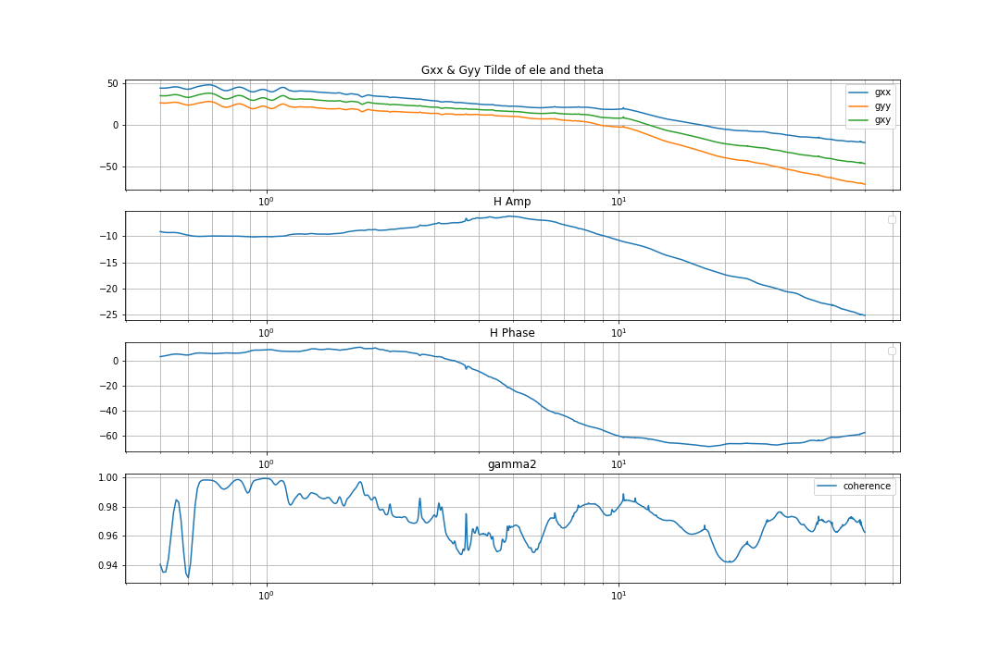
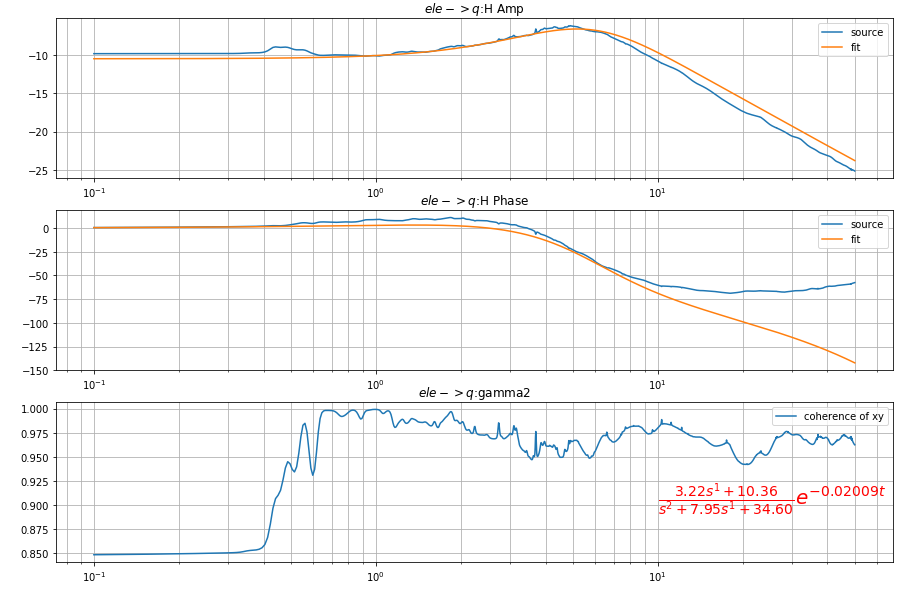
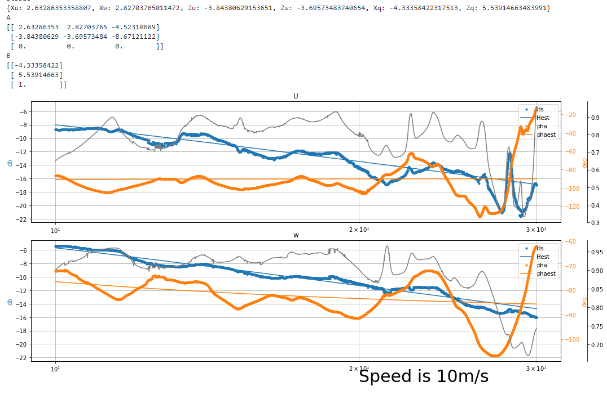
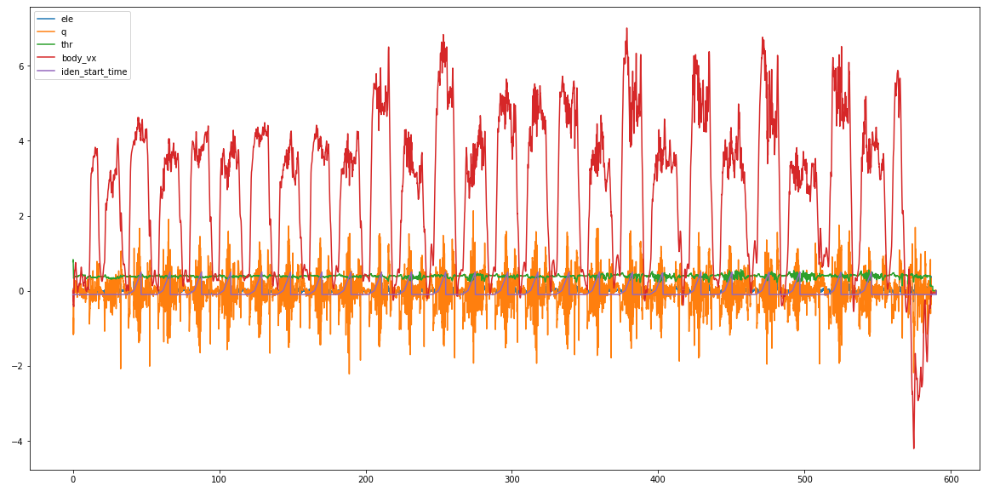

# pyAircraftIden
This project stand for system identification for aircraft or other system.

## Single-input Multi Output Frequency
For frequency identification

```python
simo_iden = FreqIdenSIMO(time_seq_source, omega_min, omega_max, a_seq, data1_seq, data2_seq ..., win_num=None)
simo_iden.plt_bode_plot(0)
```
__time_seq_source__ is the time series, __a_seq__ is your input data, __data1_seq, data2_seq ...__ are your output data
__omega_min, omega_max__ are your min and max angular frequency.



Also, please take a look at [SIMO example](./examples/FreqIdenExample.ipynb)

## Transfer Function Identification
For transfer Function identification, the just specify your transfer function model and the frequnecy domain to fit.


```python
# Set transfer function model
num = d
den = a*s*s + b*s + c

tfpm = TransferFunctionParamModel(num, den, tau)

#Use freq, H, gamma2 output from SIMO identification
# Nw gives the sample point for optimization
# Iter times is the trial times
# Reg is regularization parameter
fitter = TransferFunctionFit(freq, H, gamma2, tfpm, nw=20, iter_times=50, reg = 0.1)

```
Please check take a look at [SIMO example](./examples/FreqIdenExample.ipynb) also.



Also [Tail-sitter example](./examples/TSCruisingFreqResQFitting.ipynb) gives a more complex example on transfer function fitting with real world experiment data of a Tail-sitter VTOL UAV, the data is collect via Pixhawk.

## State-space Idenification
This project uses frequency approach for state-space identification.


```python
th0 = trims["theta"]

# Set unknown parameters
Xu, Xw, Xq = sp.symbols('Xu Xw Xq')
Zu, Zw, Zq = sp.symbols('Zu Zw Zq')
Mu, Mw, Mq = sp.symbols('Mu Mw Mq')

#Set state space formula
#AX' = FX + GU
#y = H0 X+ H1 X'
F = sp.Matrix([[Xu, Xw, -g * math.cos(th0)],
            [Zu, Zw, -g * math.sin(th0)],
            [0, 0, 0]])

G = sp.Matrix([[Xq],[Zq],[1]])
# direct using -u w q for y
#U equal to negative u
H0 = sp.Matrix([
    [-1, 0, 0],
    [0, 1, 0]])
H1 = sp.Matrix([
    [0, 0, 0],
    [0, 0, 0],
])
syms = [Xu, Xw,Zu, Zw,Xq,Zq]

#Set state space Model with unknow parameters
LatdynSSPM = StateSpaceParamModel(M, F, G, H0, H1, syms)

#Act frequency idenification first
freqres = freqres_10ms.get_freqres(indexs = [1,0])

#Act State space idenification
ssm_iden = StateSpaceIdenSIMO(freqres, accept_J=150,
                            enable_debug_plot=False,
                            y_names=['U',"w"],reg=0.0 )
J, ssm = ssm_iden.estimate(LatdynSSPM, syms, constant_defines={})
# Check stable
ssm.check_stable()
#Draw and print
ssm_iden.draw_freq_res()
ssm_iden.print_res()
```

Check [State Space example](./examples/TSCruisingSSM.ipynb) for details

## PX4 ULog data parsing
PX4 records ULog data, read PX4 data is easy with this project

```python
fpath = "data/foam-tail-sitter/log_32_2018-4-10-15-53-08.ulg"
px4_case = PX4AircraftCase(fpath)
needed_data = ['ele', 'q', 'thr', 'body_vx', "iden_start_time"]
t_arr, data_list = px4_case.get_data_time_range_list(needed_data)
```

Check  [Tail-sitter example](./examples/TSCruisingFreqResQFitting.ipynb) for details.

Here shows the Ulog data read from ulog


## Examples
In data and examples, contain data and analyse, first for a Cessna 172sp. Data is collect in X-Plane Simulator. Second is a Tail-sitter VTOL, data is collect in real world experiment.

Cessna example:
[SIMO example](./examples/FreqIdenExample.ipynb)

Tail-sitter example:
[Tail-sitter example](./examples/TSCruisingFreqResQFitting.ipynb)

[Tail-sitter pitch example](./examples/TSCruisingFreqResPitch.ipynb)

[State Space example](./examples/TSCruisingSSM.ipynb): this require [Tail-sitter example](./examples/TSCruisingFreqResPitch.ipynb) first.

## Reference
Please Check 
**Remple, Robert K., and Mark B. Tischler.Aircraft and rotorcraft system identification: engineering methods with flight-test examples. American Institute of Aeronautics and Astronautics, 2006.** for algorithm details.

## License
This project uses MIT license

Enjoy!